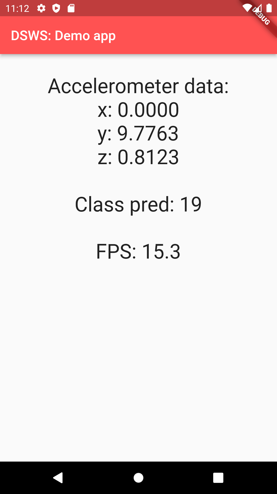

<div align="center">
<h1 align="center">DSWS: Deep Smart Watch Sensors</h1>
<h3 align="center">Framework for training and deploying deep models for smart sensor systems</h3>

[](https://opensource.org/licenses/MIT)

[](https://github.com/andreped/DSWS/releases)
 
**DSWS** was developed by SINTEF Health with aim to integrate AIs into smart watch sensor systems. From training RNNs to deploing them in real time in a mobile app!
</div>


## Setup

When using this framework, it is a good idea to setup a virtual environment:
```
virtualenv -ppython3 venv --clear
./venv/Scripts/activate
pip install -r requirements.txt
```

Tested with Python 3.7.9.

## Usage

To train a model, simply run:
```
python main.py
```

The script supports multiple arguments. To see supported arguments, run `python main.py -h`.

## Training history

To visualize training history, use TensorBoard (with example):
```
tensorboard --logdir .\output\logs\gesture_classifier_arch_rnn
```

Example of training history for a Recurrent Neural Network (RNN) can be seen underneath:


The figure shows macro-averaged F1-score for each step during training, with black curve for training and blue curve for validation sets.
Best model reached a macro-averaged F1 score of 99.66 % on the validation set, across all 20 classes.

**Disclaimer:** This model was only trained for testing purposes. The input features were stratified on sample-level and not patient-level, and thus validation performance will likely not represent true performance on new data. However, having a trained model enables us to test it in a Mobile app.

## Mobile app

A simple Mobile app was developed in Flutter, which demonstrates the AI in action using the accelerometer data from the mobile phone in real time:

<div align="center">

</div>

## Feature structure

I'm currently using the SmartWatch Gestures dataset,
which is available in tensorflow-datasets. The dataset has the
following structure:
```
FeaturesDict({
    'attempt': tf.uint8,
    'features': Sequence({
        'accel_x': tf.float64,
        'accel_y': tf.float64,
        'accel_z': tf.float64,
        'time_event': tf.uint64,
        'time_millis': tf.uint64,
        'time_nanos': tf.uint64,
    }),
    'gesture': ClassLabel(shape=(), dtype=tf.int64, num_classes=20),
    'participant': tf.uint8,
})
```

## Other datasets

Human activity smart devices (lots of data, but no labels):
https://www.kaggle.com/datasets/sasanj/human-activity-smart-devices?select=smartwatch.csv

Dataset from UiT (only info on devices, no activity data):
https://dataverse.no/dataset.xhtml?persistentId=doi:10.18710/6ZWC9Z

Large database including lots of timeseries benchmark datasets:
https://archive.ics.uci.edu/ml/datasets.php?format=&task=&att=&area=&numAtt=&numIns=&type=ts&sort=nameDown&view=list

Dataset for gesture classification using MYO thalmic bracelet:
https://archive.ics.uci.edu/ml/datasets/EMG+data+for+gestures#

